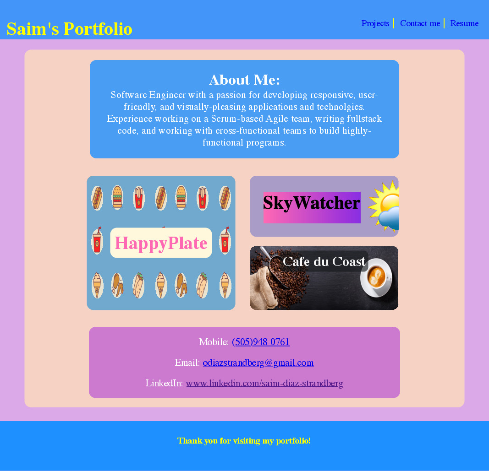

# Berkeley Coding Bootcamp Challenge 2
2nd coding bootcamp challenge where students were asked to create a professional portfolio which displays to potential employers work samples, contact information, and a section that has a short "about me" paragraph.

The live version of this project can be accessed at: https://ojds2022.github.io/saims_portfolio/

